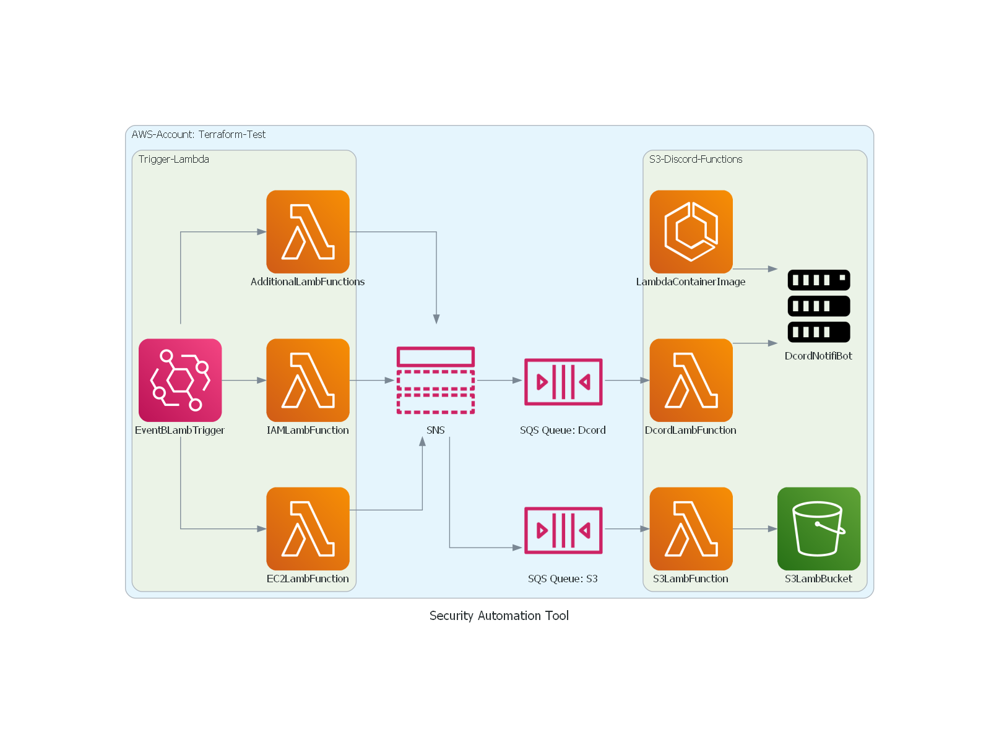
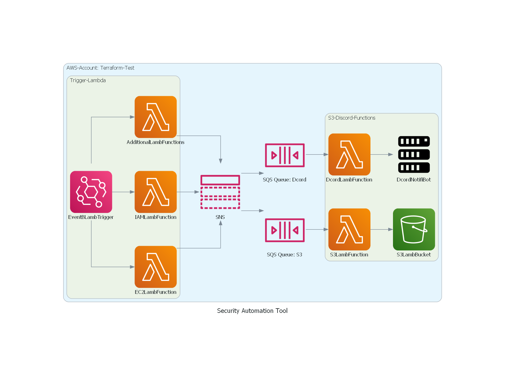

# Change Log
All notable changes to this project will be documented in this file.
 
## [1.1.0] - 2023-11-14
 
Utilization of ECR to containerize a controlled environment
 

### Added
- [Docker-YAML-GitActions](https://github.com/RavenEsc/AWS_Security_Automation_Tool/blob/e204e13e41e8c6f4a474d13a1fbfee50a7f0849c/.github/workflows/docker.yml)
  Runs the Docker GitHub Actions workflow to build and push a container image to a private ECR repository for Discord-Lambda-Notification to use
- [Terraform-YAML-GitActions](https://github.com/RavenEsc/AWS_Security_Automation_Tool/blob/e204e13e41e8c6f4a474d13a1fbfee50a7f0849c/.github/workflows)
  Runs the Terraform plan and apply GitHub Actions workflows to sync up with Terraform Cloud to test and deploy commits
- [Docker-environment](https://github.com/RavenEsc/AWS_Security_Automation_Tool/blob/7ade707e68c5f5a5fb18568440b61ae90193c45f/code/discordlambda)
  The folder with the requirement.txt, lambda function code, and the Dockerfile to build the container image for the Discord-Lambda-Notification
 
## [1.0.0] - 2023-10-31

Initial Release

## Added
- [Discord-Lambda-Notification](https://github.com/RavenEsc/AWS_Security_Automation_Tool/blob/3c857eeabac85828bfaf7105a902d4701d27ddaf/tf/3-DiscordLambdaFunction.tf)
    Terraform -- Handles notifications to Discord

- [S3-Lambda-logStorage](https://github.com/RavenEsc/AWS_Security_Automation_Tool/blob/9b8e3ae92e9274c5f87ef3ff487eff1c35b2c6dc/tf/3-S3LambdaFunction.tf)
    Terraform -- Handles JSON log storage to S3

- [SQS-Fanout](https://github.com/RavenEsc/AWS_Security_Automation_Tool/blob/b44e65336e914c4b26719e2a672aa621e42b8fa6/tf/2-FanoutResources.tf)
    Terraform -- Handles decoupling and sending the messages to storage and discord for processing.

- [Public-EC2-Check](https://github.com/RavenEsc/AWS_Security_Automation_Tool/blob/2b04deba78b880f16e681c47f1db1ee6a866696b/tf/1-EC2checkLambdaFunction.tf)
    Terraform -- Handles the Python script to check for unwanted open ports on EC2 instances.

- [IAM-Admin-Check](https://github.com/RavenEsc/AWS_Security_Automation_Tool/blob/2b04deba78b880f16e681c47f1db1ee6a866696b/tf/1-IAMcheckLambdaFunction.tf)
    Terraform -- Handles the Python Script to check for Unauthorized Admin privileges granted.

- [Daily-EventBridge-Scheduler](https://github.com/RavenEsc/AWS_Security_Automation_Tool/blob/b44e65336e914c4b26719e2a672aa621e42b8fa6/tf/1-EventBridgeLambdaTrigger.tf)
    Terraform -- Handles daily triggering the Lambda Checks