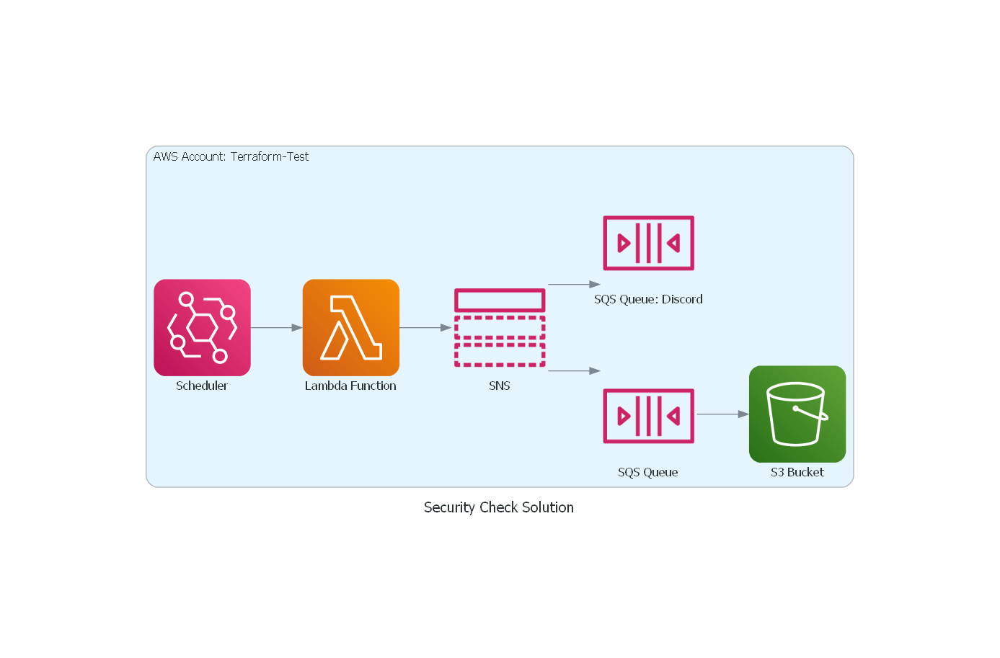

# Project SAT

# 
 Stage 1 & 2: Ideation and Requirement Collection

## Meeting 1:
Goal setting!
### Made A Goal:

**Build A Security Service that Checks for compliance or vulnerability issues!**

**Discussed Rules:**
 1. Checks for publically accessible EC2 instances (Route table configs)

 2. Checks for publically shared IAM resource policies
 3. Checks for overly permissive User/Role IAM policies
 4. All checks should be automated
 5. All checks should run at a set interval (like 3 am every night)
 6. All results should be stored somewhere for later review

**(BONUS GOALS)**

 7. Infrastructure should be documented in a Diagram as Code format (For a visual representation of the initial plans versus the final product)

 8. Only use the AWS CLI and Terraform
 9. All results from the checks should be done timely (like under 5 minutes)

**Asked two interview questions:**
1. Why should you avoid using the root account? What steps would you take to do so?

2. What is the difference between a NACL and a Security Group?

### Next Meeting:
 Set a sub-goal:
 - Plan out the way in which this will be done (Infrastructure, language, etc.)

# 
 Stage 3: Design

- I put up a private Github repository for ease of collaboration and an eventual CI/CD automated workflow

- I installed Diagram through pip on my windows machine for DaC development

- Researched possibilities and avenues of development (CLI, EC2, ECS, Lambda, etc.)

## Meeting 2:

Laid out a plan and a Diagram:

&rarr; An Eventbridge Scheduler runs an event periodically

&rarr; That event will trigger a Lambda Function to run a python script that will (currently) check for an EC2 route table entry that is public

&rarr; Any results would be printed into a log file with a timestamp header and placed in an S3 bucket

&rarr; If the lambda function finds an issue or vulnerability it will log the event and send the results to SNS that will fans-out the messages to two SQS Queues, one for the S3 bucket and another to Discord for an alert message.

As of now, the focus is to get the infrastructure up and ready for development and testing!

### Next Meeting:
 Set a sub-goal:
 - Have the plan of how the infrastructure will look like flushed out and get started in prototyping/developing the structure.

___

- Learned how to make DaC and made the first draft.

- I began to write in my notes to make note of my progress and the process that it took to make this service.

- Began to dive into Terraform development of my infrastructure and the python scripting needed to perform the check!
  

