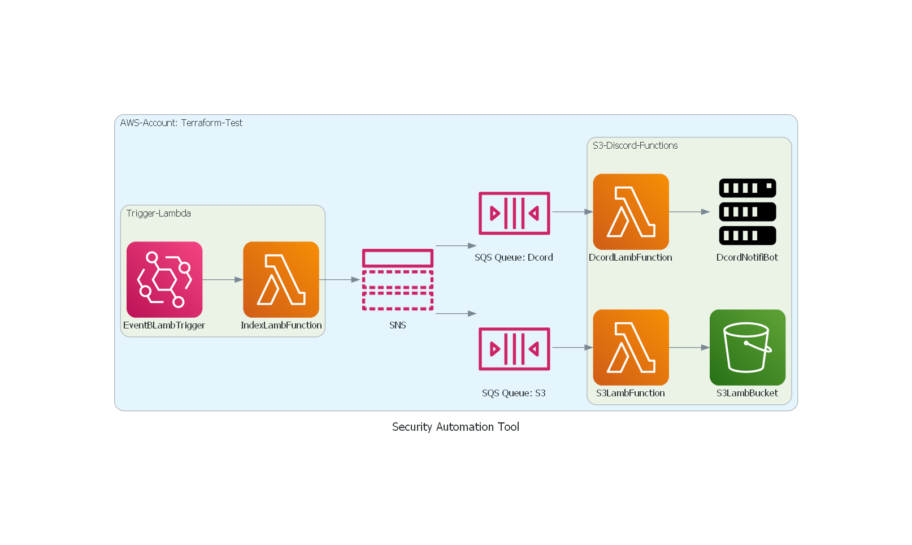

# Project SAT

Update:

- Developed and designed the terraform and python codes, undeployed

- Created a main file for terraform, then split it up into several segments of code with relative organization (Main rough draft code is in RoughDraft-Designs.txt)

- Updated draft, cannot link SQS to Discord or S3 without a lambda function to format it

  

<!-- ## Meeting 3:

&rarr; 

&rarr; 

&rarr; 

&rarr; 

### Next Meeting:
 Set a sub-goal:
  -->