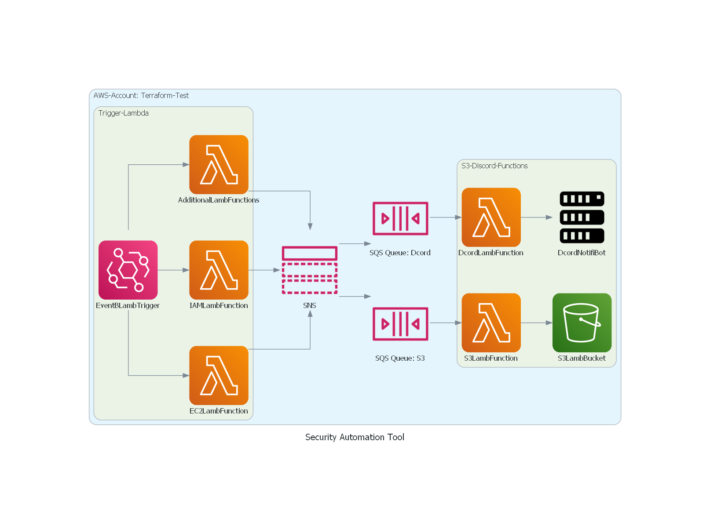

# AWS_Security_Automation_Tool (Project SAT)

This tool will automate the workflow of security checks for EC2 instances and IAM entity policies. It will accomplish this task by utilizing the serverless infrastructure of Lambda and perform periodic checks backed by python and driven with Amazon EventBridge.

After it has performed a check, if any test has failed it will log the event and notify the event to the admin account.

It will also be able to handle an influx of issues by using the SNS and SQS Queue Fan-Out Method and send a notification via Discord and the log of the event to an Amazon S3 bucket.

Updates to the code are logged in the [Change Log](https://github.com/RavenEsc/AWS_Security_Automation_Tool/blob/7a5221d1bafd2a4b6fc40a0dbf974fed54f4ba75/CHANGELOG.md)!

